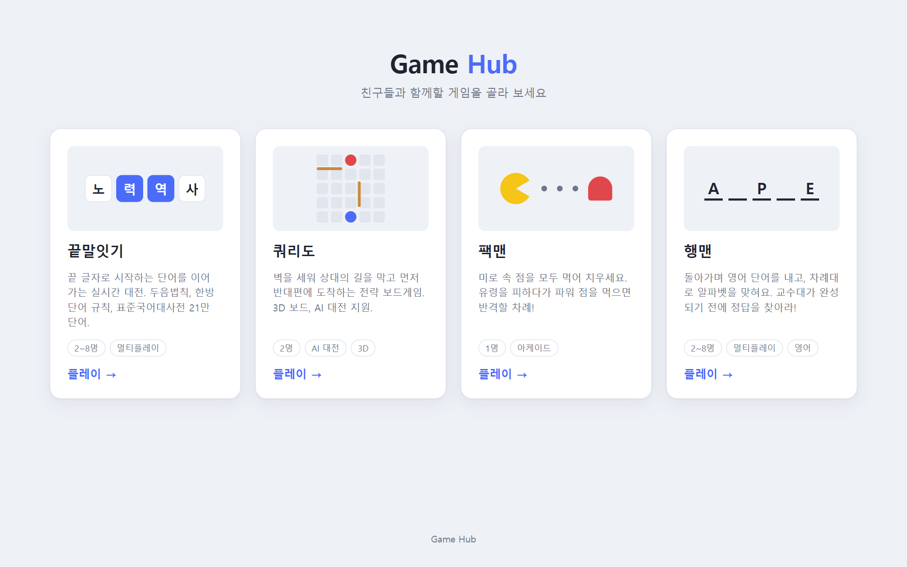
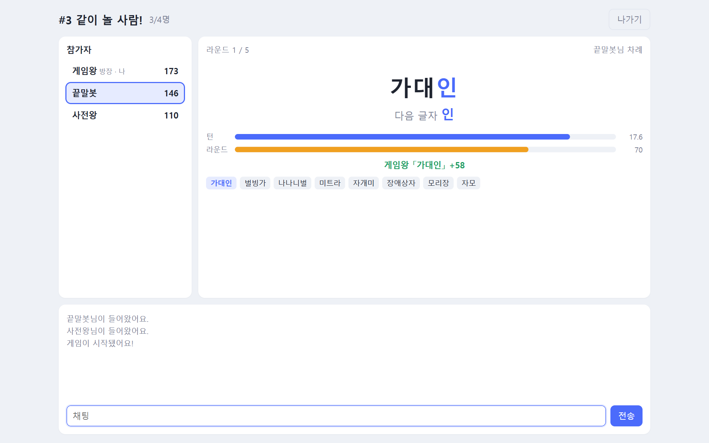
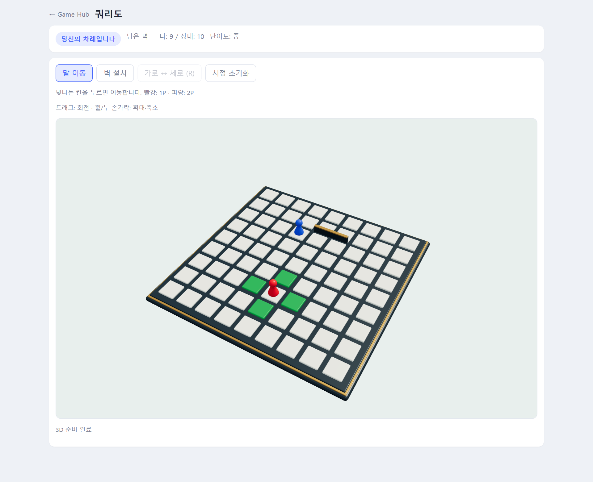
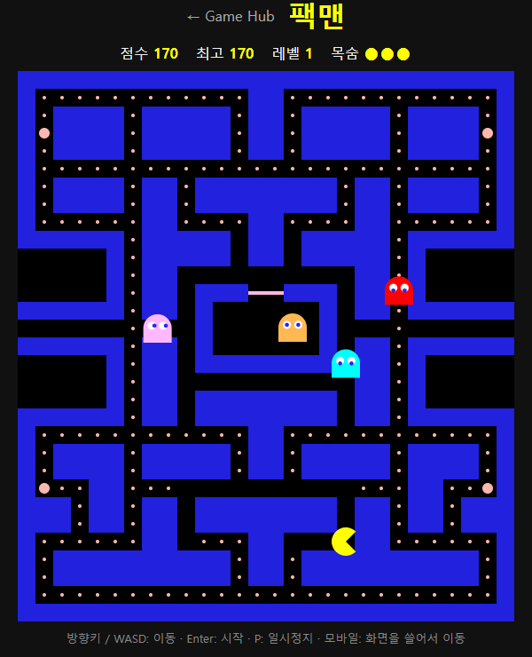
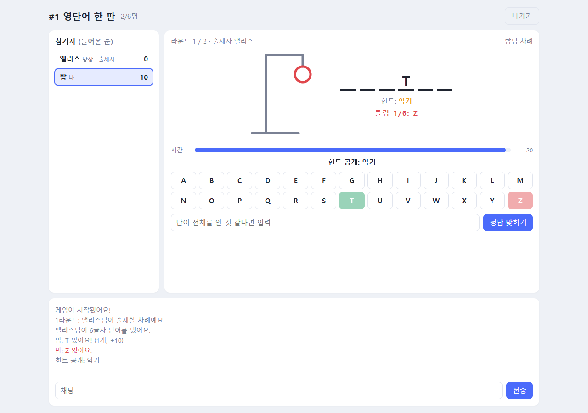

# 🎮 Game Hub

**설치도, 가입도 없이. 링크 하나로 친구들과 바로 한 판.**

### [▶ 지금 플레이하기](http://100.53.186.9)

---

## 게임

| | 게임 | 인원 | 한 줄 소개 |
|:-:|---|:-:|---|
| 🔤 | **[끝말잇기](wordchain/README.md)** | 2~8명 | 21만 단어 사전으로 겨루는 실시간 끝말잇기 |
| 🧱 | **[쿼리도](quoridor/README.md)** | 1~2명 | 벽을 세워 길을 막는 3D 전략 보드게임 |
| 🟡 | **[팩맨](pacman/README.md)** | 1명 | 유령을 피해 미로 속 점을 먹어 치우는 아케이드 |
| 🔠 | **[행맨](hangman/README.md)** | 2~8명 | 돌아가며 영어 단어를 내고 차례대로 맞히는 추리 게임 |

### 🔤 끝말잇기

끝 글자를 이어 가며 제한 시간 안에 단어를 대는 실시간 대전입니다.
**표준국어대사전 21만 단어**로 판정하고, 두음법칙(력 → 역)과 한방단어 규칙까지 챙겼어요.
빨리 칠수록, 긴 단어일수록 점수가 올라갑니다.

[게임 설명 보기 →](wordchain/README.md)

### 🧱 쿼리도

말을 한 칸씩 움직이거나 벽을 세워서, 상대보다 먼저 반대편 끝에 도착하면 이기는 전략 보드게임입니다.
돌리고 확대할 수 있는 **3D 보드**에서 친구와 1:1로 붙거나 **AI**(하·중·상)와 대결할 수 있어요.
AI가 한 수 한 수를 어떻게 평가하는지 보여주는 **학습 모드**도 있습니다.

[게임 설명 보기 →](quoridor/README.md)

### 🟡 팩맨

유령 네 마리를 피해 미로 속 점을 모두 먹어 치우는 고전 아케이드 게임입니다.
파워 점을 먹으면 잠깐 동안 유령을 거꾸로 잡아먹을 수 있어요. 레벨이 오를수록 빨라집니다.

[게임 설명 보기 →](pacman/README.md)

### 🔠 행맨

한 명이 영어 단어를 내면, 나머지가 차례대로 알파벳을 골라 맞히는 게임입니다.
틀릴 때마다 교수대가 한 획씩 그려져요. 모두가 돌아가며 출제자가 되고, 추측이 길어지면 힌트가 열립니다.

[게임 설명 보기 →](hangman/README.md)

---

## 이렇게 시작하세요

1. **[Game Hub](http://100.53.186.9)에 접속**해서 하고 싶은 게임을 고릅니다.
2. **닉네임을 정하거나 방을 만듭니다.** 가입도 로그인도 필요 없어요.
3. **친구에게 주소를 보내세요.** 같은 방에 들어오면 바로 시작입니다.

크롬, 엣지, 사파리 같은 최신 브라우저에서 동작합니다. 앱을 설치할 필요는 없어요.

## 자주 묻는 질문

<b>회원가입을 해야 하나요?</b>

아니요. 끝말잇기와 행맨은 닉네임만 입력하면 되고, 쿼리도와 팩맨은 바로 시작할 수 있어요.

<b>점수나 전적이 저장되나요?</b>

아직은 저장하지 않아요. 한 판이 끝나면 결과를 보여주고 그걸로 끝입니다. 팩맨 최고 점수만 내 브라우저에 저장돼요.
서버를 점검하면 진행 중인 방도 초기화돼요.

<b>"이미 접속 중인 닉네임"이라고 떠요.</b>

같은 닉네임을 다른 사람이 쓰고 있거나, 다른 기기에서 접속한 연결이 아직 남아 있는 경우예요.

- **같은 브라우저**라면 다시 입장할 때 예전 연결을 자동으로 이어받아요.
- **다른 기기**에서 쓰던 닉네임이라면 1분 정도 뒤에 다시 시도해 주세요.

<b>화면이 이상하거나 예전 모습 그대로예요.</b>

업데이트 직후라면 브라우저가 예전 화면을 기억하고 있을 수 있어요.
<kbd>Ctrl</kbd> + <kbd>F5</kbd>(맥은 <kbd>Cmd</kbd> + <kbd>Shift</kbd> + <kbd>R</kbd>)로 새로고침해 주세요.

<b>끝말잇기에서 욕도 인정되나요?</b>

네. **사전에 실린 말이면 비속어도 인정**합니다.
사전에는 없지만 흔히 쓰는 몇몇 비속어도 따로 추가해 두었어요.
친구끼리 편하게 즐기되, 모르는 사람과 할 때는 매너를 지켜 주세요.

## 업데이트 소식

| 날짜 | 내용 |
|---|---|
| 2026-10-01 | 🔠 **행맨 추가** (2~8명, 돌아가며 출제) |
| 2026-10-01 | 🟡 **팩맨 추가** (1인용) |
| 2026-09-30 | 🎉 **Game Hub 오픈**: 끝말잇기와 쿼리도를 한곳에서 |
| 2026-09-30 | 두 게임 디자인 통일, 끝말잇기 단어 착지 효과 |
| 2026-09-30 | 끝말잇기 닉네임 중복 접속 방지, 빈 방 자동 정리 |
| 2026-09-29 | 끝말잇기 사전을 **표준국어대사전 21만 단어**로 확장, 비속어 인정 |
| 2026-09-29 | 끝말잇기 첫 공개: 로비, 방, 두음법칙, 한방단어 규칙 |
| 2026-09-26 | 쿼리도 **3D 보드**와 캐릭터 애니메이션 |

## 준비 중

- 🔤 끝말잇기: 맞힌 단어의 뜻풀이 보여주기, 관전 모드, 쿵쿵따·앞말잇기 모드
- 🧱 쿼리도: 온라인 대전 재접속
- 🟡 팩맨: 보너스 과일, 친구와 점수 겨루기
- 🎮 Game Hub: 새로운 게임 추가

하고 싶은 게임이나 불편한 점이 있다면 [이슈](https://github.com/kminh-wow/Game_hub/issues)로 알려 주세요.

## 출처

- 끝말잇기 사전: 국립국어원 [표준국어대사전](https://stdict.korean.go.kr)
- 행맨 영어 사전: ENABLE word list (퍼블릭 도메인)
- 3D 렌더링: [three.js](https://threejs.org) (MIT License)

 

개발 참여나 직접 서버를 띄우는 방법은 [개발 문서](docs/DEVELOPMENT.md)에 있어요.
