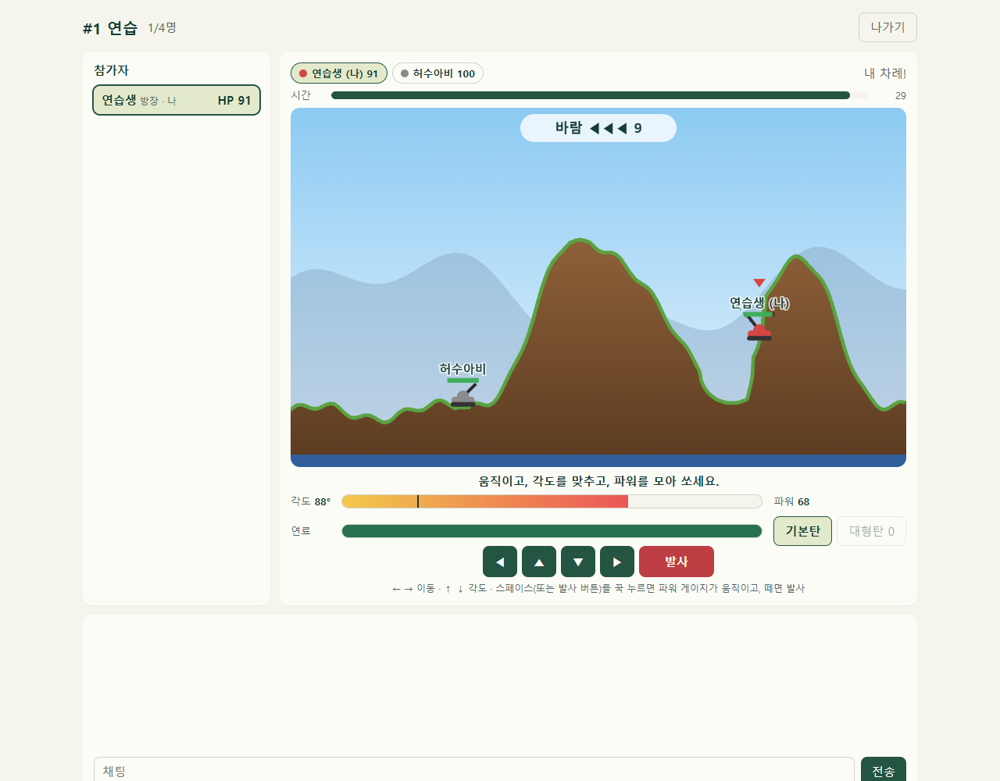

# 💥 포트리스 (Fortress)

**산 너머 탱크를 향해, 각도와 파워를 맞춰 한 방!**

### [▶ 지금 플레이하기](http://100.53.186.9/fortress/)

---

## 이런 게임이에요

산이 솟은 2D 전장에 탱크가 흩어져 있어요. 돌아가며 한 차례씩 **움직이고, 포신 각도를 맞추고, 파워를 모아 쏘세요.**
포탄이 떨어진 자리는 땅이 파이고, 발밑이 꺼진 탱크는 아래로 떨어져요. **마지막까지 남은 탱크가 이깁니다.**

- 👫 **2~4명** 실시간 대전
- 🎯 혼자라면 **허수아비**(쏘지 않는 과녁)로 연습하거나 **AI(하·중·상)**와 대결
- 🌬️ 차례마다 바뀌는 **바람**
- ⛰️ 판마다 새로 만들어지는 **산 지형**, 포탄에 부서져요
- 👀 **관전**: 게임 중인 방도 로비에서 눌러서 구경할 수 있어요

## 조작

| 키 | 버튼 | 하는 일 |
|:-:|:-:|---|
| A D | ◀ ▶ | 이동 (차례마다 연료만큼). 누른 쪽을 바라봐요 |
| W S | ▲ ▼ | 포신 각도 (0~90°) |
| 스페이스 | 발사 | **꾹 누르면 파워 게이지가 오르내리고, 떼는 순간의 파워로 발사** |

게이지 위의 검은 선은 **지난번에 쏜 파워**예요. 거리를 맞춰 갈 때 기준으로 쓰세요.

## 규칙

| 항목 | 내용 |
|---|---|
| 체력 | 모두 100에서 시작 |
| 차례 | 들어온 순서대로 돌아가며, 첫 차례는 무작위 |
| 시간 | 한 차례 제한 시간(기본 30초) 안에 쏘지 않으면 차례가 넘어가요(혼자 연습할 때는 다시 내 차례). 파워를 모으던 중에 시간이 끝나면 그 파워로 바로 쏴요 |
| 이동 | 차례마다 연료 120. 오르막은 연료를 더 써요. 절벽 수준이 아니면 올라갈 수 있고, 바다로는 못 들어가요 |
| 지형 | 폭발로 생긴 구덩이 벽은 흙이 흘러내려 비탈이 돼요. 구덩이에 빠져도 걸어 나올 수 있어요 |
| 피해 | 폭발 중심에 가까울수록 커요. **직격하면 +10**. 내 포탄에 나도 맞아요 |
| 떨어짐 | 발밑이 파여서 높이 떨어지면 추가 피해 |
| 바다 | 땅이 바다 높이까지 파인 자리에 있으면 **바로 탈락** |
| 나가기 | 게임 도중 나가면 탈락 |
| 승리 | 마지막까지 남은 한 대. 동시에 모두 탈락하면 무승부 |

## 포탄

| 포탄 | 폭발 범위 | 최대 피해 | 개수 |
|---|:-:|:-:|:-:|
| 기본탄 | 보통 | 35 | 무제한 |
| 대형탄 | 넓음 | 55 | 판마다 1발 |

## 방 설정

| 설정 | 기본값 | 범위 |
|---|:-:|:-:|
| 한 차례 제한 시간 | 30초 | 10~60초 |
| 혼자일 때 상대 | 허수아비 (연습) | 허수아비 · AI 하 · AI 중 · AI 상 |

## AI

AI는 차례가 오면 바람과 지형을 보고 **포탄 궤적을 미리 계산해** 가장 가까운 상대를 노려요. 난이도에 따라 각도·파워에 오차가 섞여요.

| 난이도 | 한 발이 피해 범위 안에 떨어지는 정도 |
|---|---|
| 하 | 가끔 (열 발 중 한두 발) |
| 중 | 절반쯤 |
| 상 | 대부분. 맞힐 자신이 있으면 대형탄도 써요 |

## 팁

- 🌬️ **바람 화살표를 먼저 보세요.** 화살표가 많을수록 세고, 맞바람이면 파워를 더 줘야 해요.
- 📏 **지난 파워 표시를 기준으로** 조금씩 고쳐 가면 금방 맞아요.
- ⛰️ 산 바로 뒤에 숨으면 낮은 각도의 포탄은 산에 막혀요. 상대가 숨었으면 **높은 각도로 넘겨 치세요.**
- 🕳️ 상대 발밑을 파서 **바다까지 떨어뜨리는 것**도 방법이에요.

---

[← Game Hub로 돌아가기](../README.md)
