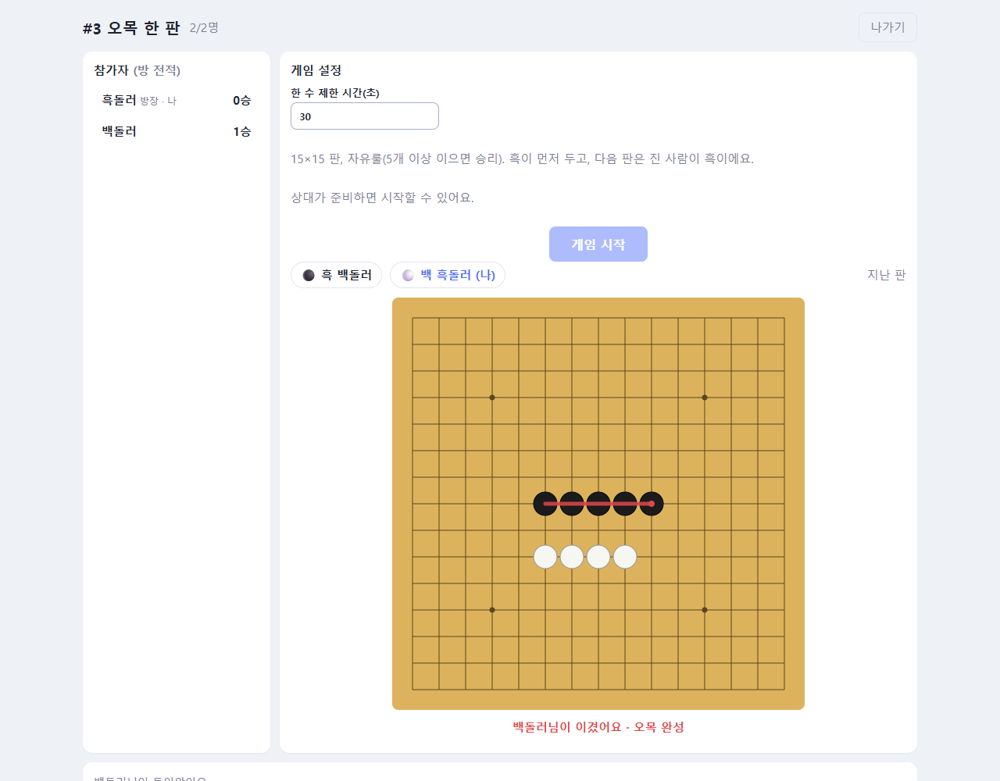

# ⚫ 오목 (Omok)

**먼저 다섯 개를 나란히 놓으면 승리**

### [▶ 지금 플레이하기](http://52.200.153.207/omok/)

---

## 이런 게임이에요

15×15 판 위에 흑과 백이 번갈아 돌을 하나씩 놓아요.
**가로, 세로, 대각선 중 한 줄로 다섯 개**를 먼저 이으면 이깁니다.

- 👫 **친구와 1:1** 실시간 대전
- 🤖 **혼자라면 AI와** 한 판
- 🏆 방 안에서 **몇 판 이겼는지** 전적이 쌓여요.
- 👀 **관전**: 게임 중이거나 꽉 찬 방도 로비에서 눌러서 구경할 수 있어요. 구경만 하고, 채팅은 할 수 있어요.

## 게임 방법

1. **닉네임을 입력**하고 로비에서 방을 만들거나 들어갑니다.
2. **친구와 두려면**: 친구가 방에 들어와 **준비**를 누르면, 방장이 **게임 시작**을 눌러요.
3. **AI와 두려면**: 방을 만들고 혼자서 **게임 시작**을 누르면 돼요.
4. 내 차례에 판 위의 교차점을 누르면 돌이 놓여요. 놓을 자리에 마우스를 올리면 흐린 돌로 미리 보여줘요.

## 규칙

| 항목 | 내용 |
|---|---|
| 판 | 15 × 15 |
| 순서 | 흑이 먼저 둬요. 첫 판은 무작위, **다음 판부터는 진 사람이 흑**이에요. |
| 승리 | 다섯 개 이상을 한 줄로 이으면 승리. 여섯 개 이상(장목)도 인정해요 (자유룰). |
| 시간 | 한 수 제한 시간(기본 30초) 안에 두지 않으면 **패배**예요. |
| 기권 | 게임 중 **기권** 버튼으로 항복할 수 있어요. |
| 무승부 | 판이 가득 차면 무승부예요. |
| 나가기 | 게임 도중 나가면 상대가 이겨요. |

## 방 설정

| 설정 | 기본값 | 범위 |
|---|:-:|:-:|
| 한 수 제한 시간 | 30초 | 10~120초 |
| AI 난이도 (혼자일 때만) | 중상 | 하 · 중 · 중상 · 상 · 최상 |

## AI 난이도

AI와 둘 때는 AI가 채팅으로 말도 걸어요. 판이 시작될 때, 내가 **좋은 수나 엉뚱한 수를 둘 때마다**(AI가 수를 평가해요), 네 개를 만들거나 막을 때, 이기고 질 때 한마디씩 하고, 채팅을 치면 받아쳐요(🤖 표시). 방 설정의 **AI 말투**를 **매운맛**으로 바꾸면 욕을 섞어 거칠게 말해요(비하·혐오·패드립은 하지 않아요).

방을 만들고 혼자 있을 때 게임 시작 전에 고를 수 있어요. 친구가 들어오면 난이도 칸은 사라지고, 게임 중에는 바꿀 수 없어요.

| 난이도 | AI는 이렇게 둬요 |
|---|---|
| **하** | 점수 높은 자리 중에서 아무 데나 둬요. 4개가 이어져도 절반은 막지 않아요. 내가 이길 수 있으면 바로 이겨요. |
| **중** | 대체로 좋은 자리에 두지만, 가끔(약 25%) 두세 번째로 좋은 자리에 둬요. |
| **중상** | 이어진 돌 수와 양끝이 열렸는지를 보고 공격과 수비를 해요. 한 칸 띄운 모양(●●_●●)은 못 봐요. |
| **상** | 띈 모양까지 읽고, 4-3·3-3처럼 한 번에 두 개를 노리는 수를 만들거나 막아요. |
| **최상** | 상의 판단에 더해, 4나 열린 3을 이어 가며 이기는 길이 있는지 직접 따져 봐요. 내 쪽에 그런 길이 생기면 놓치지 않고, 상대에게 생기면 미리 끊어요. 한 수에 최대 약 1초 생각해요. |

### AI 상대로 이기려면

- **중상 이하**는 띈 모양을 못 봐요. ●●_●● 모양을 만들어 보세요.
- **상**부터는 3-3, 4-3 같은 이중 위협이 먼저 막혀요. 두 줄이 겹치기 전에 미리 판을 잡아 두세요.

## 팁

- 🎯 **가운데부터** 두는 게 유리해요. 네 방향으로 뻗어 나갈 수 있거든요.
- 🔺 **열린 3**(양쪽이 모두 빈 세 개)을 두 개 동시에 만들면 상대가 한쪽밖에 못 막아요.
- 👀 상대의 **열린 3**은 바로 막아야 해요. 한 수 늦으면 열린 4가 돼서 막을 수 없어요.

---

[← Game Hub로 돌아가기](../README.md)
