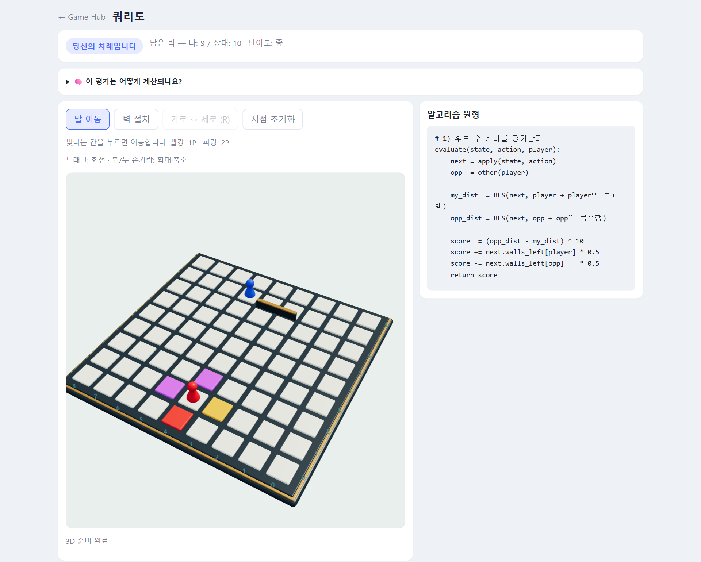

# 🧱 쿼리도 (Quoridor)

**벽을 세워 길을 막고, 먼저 건너편에 닿아라**

### [▶ 지금 플레이하기](http://100.53.186.9/quoridor/)

---

## 이런 게임이에요

9×9 보드 양 끝에서 출발한 두 말이 서로 **반대편 끝 줄**을 향해 달립니다.
내 차례마다 **말을 한 칸 움직이거나**, **벽을 세워** 상대의 길을 돌아가게 만들 수 있어요.
빠른 길을 찾는 것과 상대의 길을 막는 것, 두 가지 사이에서 고민하는 전략 게임입니다.

- 🎲 **3D 보드**: 마우스로 돌리고 확대하면서 판을 살펴볼 수 있어요.
- 👫 **친구와 1:1**: 방 코드 하나만 알려주면 바로 대전이 시작돼요.
- 🤖 **AI 대전**: 하·중·상 세 단계 난이도가 있어요.
- 👀 **관전**: 메뉴의 **"코드로 관전"**에 대전 중인 방 코드를 넣으면 구경할 수 있어요. 시점은 1P(빨강) 쪽이고, 조작과 채팅은 못 해요.
- 🧠 **학습 모드**: AI가 수를 어떻게 평가하는지 보면서 배울 수 있어요.

## 게임 모드

| 모드 | 설명 |
|---|---|
| **새 게임 만들기** | 방을 만들면 **6자리 방 코드**가 나와요. 친구에게 코드를 알려주세요. |
| **코드로 참가** | 친구에게 받은 방 코드를 입력하면 바로 대전이 시작돼요. |
| **AI와 대결** | 난이도를 골라 AI와 둡니다. |
| **학습 모드** | AI와 두면서, 내가 둘 수 있는 모든 수의 평가를 볼 수 있어요. |

### AI 난이도

| 난이도 | 특징 |
|:-:|---|
| **하** | 가장 좋아 보이는 수를 바로 두지만 가끔 실수를 해요. 처음 해 보는 분께 추천해요. |
| **중** | 좋은 후보 몇 개를 골라 **상대의 응수까지 한 수 더 내다보고** 둬요. |
| **상** | 판 위의 **모든 벽 자리**를 검토하고 더 많은 후보를 내다봐요. 만만치 않아요. |

## 규칙

- 각자 **벽 10개**를 가지고 시작해요. 1P(빨강)는 위에서, 2P(파랑)는 아래에서 출발합니다.
- 내 차례에는 둘 중 **하나만** 할 수 있어요.
  - **말 이동**: 상하좌우로 한 칸. 벽을 넘어갈 수는 없어요.
  - **벽 설치**: 두 칸 길이의 벽을 가로나 세로로 세워요.
- **점프**: 상대 말과 마주 보고 있으면 상대를 뛰어넘을 수 있어요. 뒤에 벽이 있어서 넘을 수 없다면 대각선 옆으로 비껴 갈 수 있어요.
- **길 막기 금지**: 벽은 서로 겹칠 수 없고, 누구든 목표까지 가는 길을 **완전히 막아서는 안 돼요**.
- 상대편 **끝 줄에 먼저 도착**하면 승리!

## 조작법

| 동작 | 방법 |
|---|---|
| 말 이동 | **말 이동** 모드에서 빛나는 칸을 클릭 |
| 벽 설치 | **벽 설치** 모드에서 원하는 자리를 클릭 |
| 벽 방향 바꾸기 | **가로 ↔ 세로** 버튼 또는 <kbd>R</kbd> |
| 보드 돌리기 | 드래그 |
| 확대·축소 | 마우스 휠 또는 두 손가락 |
| 시점 되돌리기 | **시점 초기화** 버튼 |

게임 화면의 채팅창으로 상대와 대화할 수 있어요.

## 학습 모드

학습 모드에서는 내가 둘 수 있는 **모든 이동과 벽**에 AI의 평가가 붙어요.

- 칸이나 벽 자리에 **마우스를 올리면** 그 수가 **최선의 수 / 좋은 수 / 괜찮은 수 / 안좋은 수** 중 어디에 해당하는지, 이유와 계산 과정까지 보여줘요.
- 평가 기준은 간단해요. **내 최단거리는 줄이고 상대 최단거리는 늘리는 수**일수록 좋은 수입니다. 최단거리는 BFS(너비 우선 탐색)로 계산해요.
- 옆의 **알고리즘 원형** 패널에서 AI가 쓰는 계산식을 그대로 볼 수 있어요.

게임을 처음 배우거나 탐색 알고리즘이 궁금한 분께 추천해요.

## 팁

- 🧱 **벽을 너무 일찍 다 쓰지 마세요.** 벽이 떨어지면 상대가 마음껏 달려와도 막을 방법이 없어요.
- 🏃 **상대가 돌아가게 만드세요.** 길을 막을 수는 없지만, 멀리 돌아가게 만드는 벽 하나가 승부를 가릅니다.
- 🔍 **막히면 학습 모드로.** 어떤 수가 좋은지 모르겠다면 학습 모드에서 평가를 참고해 보세요.

---

[← Game Hub로 돌아가기](../README.md) · 3D 렌더링: three.js · 3D 모델: 직접 제작 (Blender)
