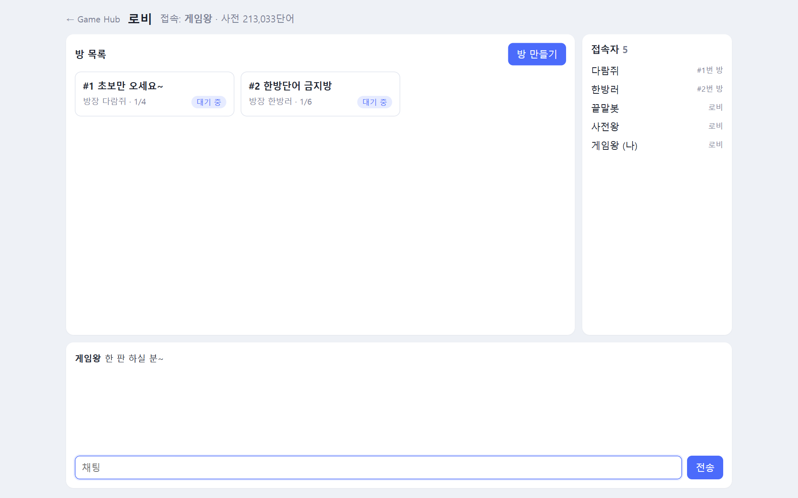
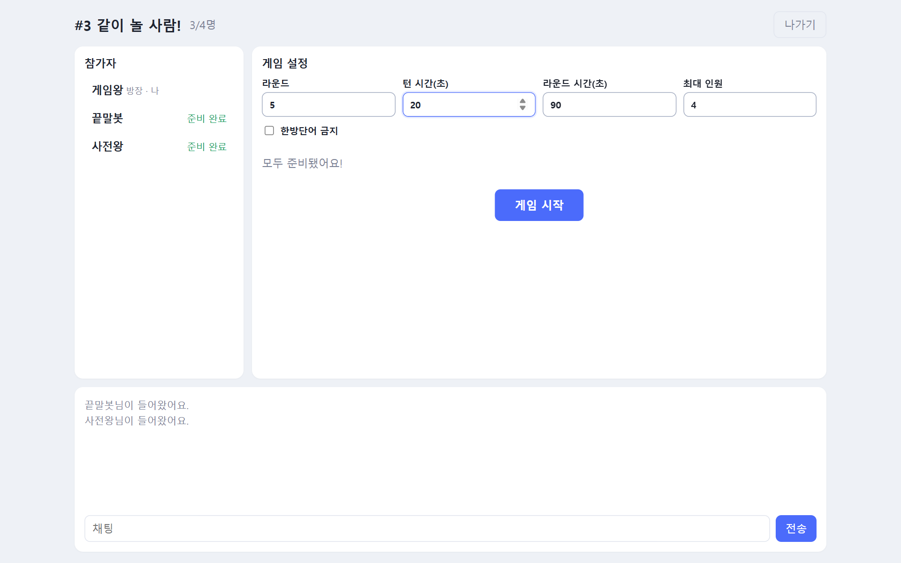

<div align="center">

# 🔤 끝말잇기

**35만 단어 사전으로 겨루는 실시간 끝말잇기**

### [▶ 지금 플레이하기](http://100.53.186.9/wordchain/)


</div>

---

## 이런 게임이에요

앞 사람이 낸 단어의 **끝 글자로 시작하는 단어**를 제한 시간 안에 입력하세요.
못 이으면 라운드에서 지고 점수가 깎입니다. 여러 라운드를 거쳐 점수가 가장 높은 사람이 이겨요.

- 👥 **2~8명**이 함께 실시간으로 겨뤄요.
- 📖 **표준국어대사전 + 끄투 단어, 약 35만 단어**로 판정해요. 사전에 없는 말은 인정하지 않아요.
- ⚡ **빠르고 길게** 칠수록 점수가 커요.
- 🧩 **두음법칙**과 **한방단어** 규칙까지 제대로 적용해요.
- 👀 **관전**: 게임 중이거나 꽉 찬 방도 로비에서 눌러서 구경할 수 있어요. 구경만 하고, 채팅은 할 수 있어요.
- 💥 단어를 맞히면 **글자가 한 자씩 쾅쾅 떨어지는** 효과로 화면에 새겨져요.

## 게임 방법



1. **닉네임을 입력**하고 로비에 들어갑니다.
2. **방을 만들거나** 목록에서 원하는 방을 눌러 들어갑니다. 게임 중인 방이나 꽉 찬 방에는 들어갈 수 없어요.
3. 참가자는 **준비**를 누르고, 모두 준비되면 방장이 **게임 시작**을 누릅니다.
4. 라운드가 시작되면 **제시어**가 나와요. 첫 사람은 제시어의 끝 글자로 시작하는 단어를 입력합니다.
5. **내 차례에 채팅창에 입력하면 단어로 제출**돼요. 차례가 아닐 때 입력하면 그냥 채팅입니다.

## 규칙

| 규칙 | 설명 |
|---|---|
| 끝 글자 잇기 | 앞 단어의 **끝 글자로 시작하는 두 글자 이상의 명사**를 냅니다. |
| 두음법칙 | 끝 글자가 두음법칙 대상이면 바뀐 글자로도 이을 수 있어요. 예: 노**력** → **역**사, 나**라** → **나**비, 소**녀** → **여**름 |
| 중복 금지 | 한 라운드 안에서 이미 나온 단어는 다시 쓸 수 없어요. |
| 시간 초과 | 턴 시간 안에 못 이으면 **-50점**, 그 라운드는 끝나요. 진 사람이 다음 라운드를 먼저 시작합니다. |
| 라운드 시간 | 라운드 전체 시간은 모두가 함께 씁니다. 라운드 시간이 줄어들수록 턴 시간도 짧아져서 후반으로 갈수록 긴장감이 커져요. |
| 한방단어 | 뒤에 이을 단어가 사전에 하나도 없는 단어예요. 예: 나무**꾼**, 알루미**늄**, 새벽**녘**. 방 설정에서 금지할 수 있어요. |

## 점수

```
획득 점수 = 글자 수 × 10  +  속도 보너스
```

- **속도 보너스**는 남은 턴 시간에 비례해요. 입력하자마자 내면 기본 점수의 최대 **2배**를 받아요.
- 예를 들어 세 글자 단어를 턴 시간이 절반 남았을 때 내면 `30 + 15 = 45점`이에요.
- 잇지 못하면 **-50점**이에요.

## 방 설정



방장은 대기실에서 설정을 바꿀 수 있어요.

| 설정 | 기본값 | 범위 |
|---|:-:|:-:|
| 라운드 | 5 | 1~10 |
| 턴 시간 | 15초 | 5~30초 |
| 라운드 시간 | 90초 | 30~300초 |
| 최대 인원 | 4명 | 2~8명 |
| 한방단어 금지 | 끔 | 켬 / 끔 |
| 어인정 단어 허용 | 켬 | 켬 / 끔 |

## 사전

두 가지 사전을 합쳐서 약 **35만 단어**를 씁니다.

- 국립국어원 **표준국어대사전** (약 21만 단어)
- 원조 **끄투(KKuTu)** 단어 DB에서 끄투 끝말잇기가 인정하는 단어 (약 35만 단어, 대부분 겹쳐요)

인정 기준은 이래요.

- **인정하는 말**: 두 글자 이상의 명사 위주. 외래어, 전문어, 지명·인물처럼 끄투에서 인정하는 말도 들어가요.
- **인정하지 않는 말**: 구, 관용구, 속담, 동사·형용사처럼 활용하는 말
- **어인정 단어**: 끄투 사용자들이 등록한 신조어, 게임·애니 이름 같은 말(약 1만 개)이에요. 예: 극혐, 꿀잼, 틱톡. **방 설정에서 켜고 끌 수 있어요** (기본은 켬).
- **비속어**: 사전에 실린 말이면 인정해요. 명사가 아닌 욕(제기랄, 젠장 등)도 포함했고, 사전에는 없지만 흔히 쓰는 비속어 몇 가지는 따로 추가했어요.

## 팁

- 🎯 **두음법칙을 기억하세요.** "력", "량", "녀"로 끝나는 단어가 오면 "역", "양", "여"로도 이을 수 있어요.
- 🧱 **한방단어로 끝내기.** 한방단어가 허용된 방이라면 '~꾼', '~늄'으로 끝나는 단어처럼 이을 말이 없는 단어로 상대를 궁지에 몰 수 있어요.
- ⏱️ **라운드 후반을 조심하세요.** 라운드 시간이 거의 남지 않았을 때 차례가 오면 턴 시간이 1~2초밖에 없어요.

## 자주 묻는 질문

<details>
<summary><b>분명 있는 단어인데 "사전에 없는 단어"래요.</b></summary>

표준국어대사전에 **명사로 실린 말만** 인정해요. 신조어, 고유명사(사람 이름, 상표 등), 활용하는 말(예: 달리다)은 사전 기준에 따라 빠질 수 있어요.
</details>

<details>
<summary><b>게임 도중 나가면 어떻게 되나요?</b></summary>

게임은 남은 사람끼리 계속됩니다. 내 차례에 나가면 다음 사람에게 바로 차례가 넘어가요.
남은 사람이 1명이 되면 게임이 끝나고, 방에 아무도 없으면 방은 자동으로 사라져요.
</details>

<details>
<summary><b>방장이 나가면요?</b></summary>

가장 먼저 들어온 사람이 새 방장이 됩니다.
</details>

## 준비 중

- 맞힌 단어의 **뜻풀이** 보여주기
- **관전 모드**
- **쿵쿵따**, **앞말잇기** 같은 다른 모드
- 효과음과 애니메이션

---

<sub>[← Game Hub로 돌아가기](../README.md) · 사전 데이터 출처: 국립국어원 표준국어대사전</sub>
