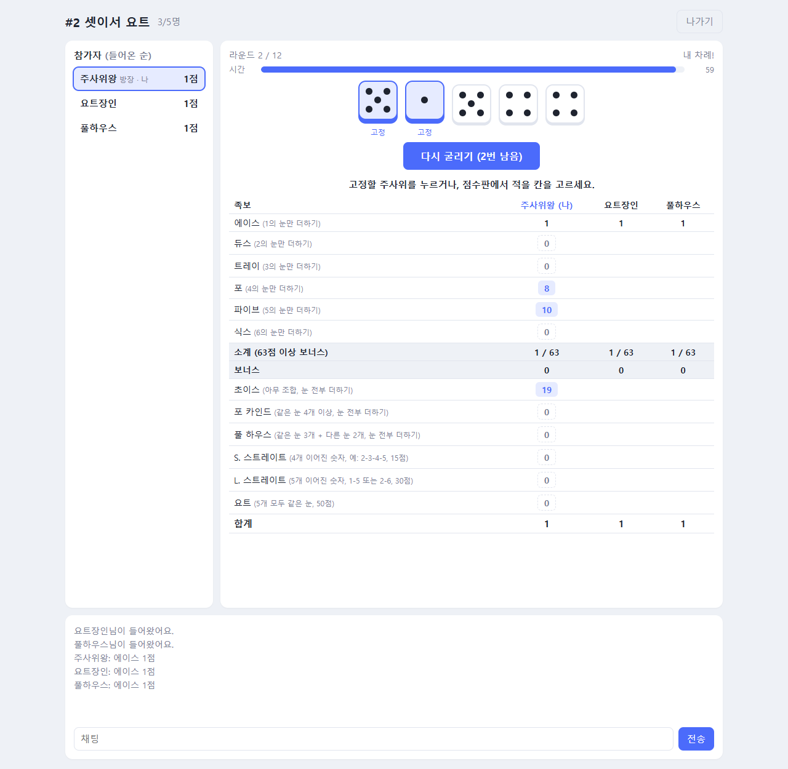

# 🎲 요트 다이스 (Yacht Dice)

**주사위 5개, 굴릴 기회는 세 번. 족보를 채워 최고 점수를 노려라**

### [▶ 지금 플레이하기](http://52.200.153.207/yacht/)

---

## 이런 게임이에요

차례마다 주사위 5개를 **최대 3번** 굴려서, 점수판의 **족보 12칸 중 하나**에 점수를 적어요.
12라운드 동안 모든 칸을 채우고 나면 합계가 가장 높은 사람이 이겨요.

- 👥 **1~5명**이 함께해요. 혼자라면 연습 모드!
- 🎲 주사위가 **데굴데굴 굴러가는 애니메이션**을 모두가 함께 봐요.
- 👀 다른 사람이 어떤 주사위를 고정했는지, 어디에 적으려고 고민하는지 실시간으로 보여요.
- 👀 **관전**: 게임 중이거나 꽉 찬 방도 로비에서 눌러서 구경할 수 있어요. 구경만 하고, 채팅은 할 수 있어요.
- 🧮 점수 바로 옆에 **내 주사위 중 어떤 눈으로 그 점수가 나왔는지** 보여줘요. 예를 들어 `1 2 3 5 5`가 나오면 파이브 칸에 `10 (5+5)`라고 떠요. 처음 하는 분도 족보를 금방 익힐 수 있어요.

## 게임 방법

1. **닉네임을 입력**하고 로비에서 방을 만들거나 들어갑니다.
2. 모두 **준비**하면 방장이 **게임 시작**을 눌러요. 혼자서 시작하면 연습 모드예요.
3. 내 차례에 **굴리기**를 누르세요.
4. 남기고 싶은 주사위를 눌러 **고정**하고 **다시 굴리기**. 한 차례에 3번까지 굴릴 수 있어요.
5. 점수판에서 **적을 칸**을 누르면 차례가 끝나요. 0점이라도 한 칸은 꼭 적어야 해요.

차례는 **방에 들어온 순서대로** 돌아가요.

## 족보

| 족보 | 조건 | 점수 |
|---|---|---|
| 에이스 · 듀스 · 트레이 · 포 · 파이브 · 식스 | 해당 숫자 | 그 숫자가 나온 주사위의 합 |
| **보너스** | 위 6칸 합이 **63점 이상** | **+35** |
| 초이스 | 아무거나 | 주사위 5개의 합 |
| 포 카인드 | 같은 눈 4개 이상 | 주사위 5개의 합 |
| 풀 하우스 | 같은 눈 3개 + 2개 | 주사위 5개의 합 |
| S. 스트레이트 | 4개 연속 (1234, 2345, 3456) | 15 |
| L. 스트레이트 | 5개 연속 (12345, 23456) | 30 |
| 요트 | 5개 모두 같은 눈 | **50** |

### 점수 옆 괄호 읽는 법

점수판에서 점수 바로 옆 괄호는 **내 주사위 중 어떤 눈으로 그 점수가 나왔는지**예요. 적을 칸을 고르는 버튼(지금 주사위로 받을 점수)에도, 이미 적은 칸에도 보여요. 화면이 좁으면 점수 아래로 내려가요.

**적은 칸과 안 적은 칸**은 한눈에 구분돼요. 적은 칸은 색이 깔리고 **✓ 점수**가 보이며(0점도 ✓), 아직 안 적은 칸은 흰 배경이에요. 족보 이름 앞에도 내가 적은 항목엔 ✓가 붙고, 이름 아래 **N / 12**로 몇 칸을 채웠는지 알 수 있어요.

| 표시 | 뜻 | 예 |
|---|---|---|
| `13 (2+2+3+3+3)` | 더한 눈 | 풀 하우스 13점 |
| `10 (5+5)` | 그 숫자 눈만 더한 것 | 파이브 10점 |
| `15 (2-3-4-5)` | 이어진 눈 | S. 스트레이트 15점 |
| `50 (4×5)` | 같은 눈 5개 | 요트 50점 |
| `0 (0개)` | 그 숫자 눈이 하나도 없음 | 트레이 0점 |
| `0 (조건 안 맞음)` | 족보 조건을 못 채움 | 풀 하우스 0점 |

## 방 설정

| 설정 | 기본값 | 범위 |
|---|:-:|:-:|
| 한 차례 제한 시간 | 60초 | 20~180초 |
| 최대 인원 | 5명 | 1~5명 |

시간이 다 되면 **지금 주사위로 점수가 가장 높은 칸**에 자동으로 적혀요. 한 번도 안 굴렸으면 한 번 굴린 뒤 적어요.

## 주사위 굴리기

주사위는 위에서 떨어져 트레이와 다른 주사위에 부딪힙니다. 멈춘 뒤 위를 향한 면으로 점수를 계산하며, 모든 참가자가 같은 궤적과 결과를 봅니다. 고정한 주사위는 움직이지 않습니다. 비스듬히 걸리거나 트레이 밖으로 나간 주사위는 다시 떨어뜨립니다.

**요트 보정**: 같은 눈 2개 이상을 고정해 두고 굴릴 때는 4번에 1번꼴로 주사위를 두 번 던져 그 눈이 더 많이 나온 쪽을 골라요(두 번 다 실제 물리 결과). 그래서 요트(5개 모두 같음)가 약 1.5%p 더 자주 나와요(요트만 노릴 때 약 4.6% → 6%). 모든 참가자에게 똑같이 적용돼요.

## 팁

- 🎯 **보너스 35점을 노리세요.** 숫자 칸마다 그 숫자 3개씩(예: 식스 18점)만 모아도 딱 63점이에요.
- 🗑️ **버릴 칸을 정해 두세요.** 망한 차례에는 에이스나 초이스처럼 덜 아까운 칸에 적는 게 좋아요.
- 🎲 요트(50점)는 욕심낼 만하지만, 풀 하우스나 스트레이트를 먼저 챙기는 것도 방법이에요.

---

[← Game Hub로 돌아가기](../README.md) · 규칙은 닌텐도 「세계의 아소비 대전」의 요트를 참고했어요.
